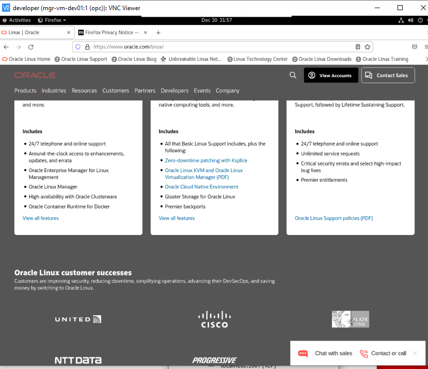

# Provision Oracle Cloud Developer

## Install Oracle Linux Cloud Developer

image source: Platform image


## change Shape


Upload the public key that works with private.key 

## login

```bash
manolete919@SIS_CEN1_071:~$ cd oracle/
manolete919@SIS_CEN1_071:~/oracle$ ssh -i private.key opc@129.213.127.9
```

## update

```bash
sudo yum -y update --skip-broken
```

## install vnc viewer

```bash
VNC-Viewer-6.22.826-Windows.exe
```

## Activating server

```bash
manolete919@SIS_CEN1_071:~/oracle$ ssh -i private.key opc@129.153.47.242
The authenticity of host '129.153.47.242 (129.153.47.242)' can't be established.
ECDSA key fingerprint is SHA256:jaHI7saiRnnkEGKqQCMYigYYa000FIfXgzWwS4zAskU.
Are you sure you want to continue connecting (yes/no/[fingerprint])? yes
Warning: Permanently added '129.153.47.242' (ECDSA) to the list of known hosts.
Activate the web console with: systemctl enable --now cockpit.socket

[opc@mgr-vm-dev01 ~]$ vncserver

WARNING: vncserver has been replaced by a systemd unit and is about to be removed in future releases.
Please read /usr/share/doc/tigervnc/HOWTO.md for more information.

You will require a password to access your desktops.

Password:
Verify:
Would you like to enter a view-only password (y/n)? n
A view-only password is not used
xauth:  file /home/opc/.Xauthority does not exist

New 'mgr-vm-dev01:1 (opc)' desktop is mgr-vm-dev01:1

Creating default startup script /home/opc/.vnc/xstartup
Creating default config /home/opc/.vnc/config
Starting applications specified in /home/opc/.vnc/xstartup
Log file is /home/opc/.vnc/mgr-vm-dev01:1.log
```

doc

```
https://www.linuxtopia.org/HowToGuides/VNC_setup_Linux_Windows.html
```

For security reasons it is recommended that the VNC communication take place through an encrypted secure tunnel connection. On Linux or Unix this can be achieved using the *ssh* command. On Windows we recommend that you use *PuTTY* which is freely available from:

   https://www.putty.nl/download.html

By default the VNC server will communicate on port 59xx where xx represents the display number. If *vncserver* announces that it is running as display :1 then the port being used is 5901. If it tells you it is display :2 then port 5902 is being used and so on.


## kill the vnc server

```bash
[opc@mgr-vm-dev01 ~]$ vncserver -kill :1

WARNING: vncserver has been replaced by a systemd unit and is about to be removed in future releases.
Please read /usr/share/doc/tigervnc/HOWTO.md for more information.
Killing Xvnc process ID 8724
```


## Transforming key to ppk

```bash
puttygen private.key -O private -o private.ppk
```

### User/password

```
manolete919/M_@n0l3te_919
```

### Installing putty-tools

```bash
manolete919@SIS_CEN1_071:~/oracle$ sudo apt install putty-tools
[sudo] password for manolete919:
Reading package lists... Done
Building dependency tree
Reading state information... Done
Suggested packages:
  putty-doc
The following NEW packages will be installed:
  putty-tools
0 upgraded, 1 newly installed, 0 to remove and 290 not upgraded.
Need to get 425 kB of archives.
After this operation, 2527 kB of additional disk space will be used.
Get:1 http://archive.ubuntu.com/ubuntu focal/universe amd64 putty-tools amd64 0.73-2 [425 kB]
Fetched 425 kB in 3s (126 kB/s)
Selecting previously unselected package putty-tools.
(Reading database ... 31876 files and directories currently installed.)
Preparing to unpack .../putty-tools_0.73-2_amd64.deb ...
Unpacking putty-tools (0.73-2) ...
Setting up putty-tools (0.73-2) ...
Processing triggers for man-db (2.9.1-1) ...
```


## create a tunnel in ubuntu

```bash
ssh -i private.key -L 5901:localhost:5901 opc@129.153.47.242
```

## create a tunnel in Putty

### Configure the server


### set the auto-login username


### Add ppx


### Add tunner localhost:5901


### Save session


## vcn viewer

```bash
localhost:5901
```

### create


Password

M@nolete919


..


### view


